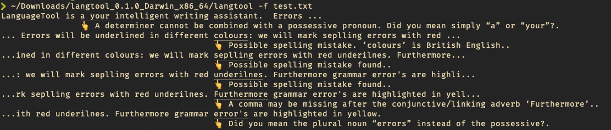

# langtool

Simple command line tool for opensource text proofreading api [https://www.languagetool.org](https://www.languagetool.org)

### Usage

```
# Install langtool to golang bin folder
go install github.com/hlcfan/langtool@master

# Run it
~/go/bin/langtool -f filename.text
```


